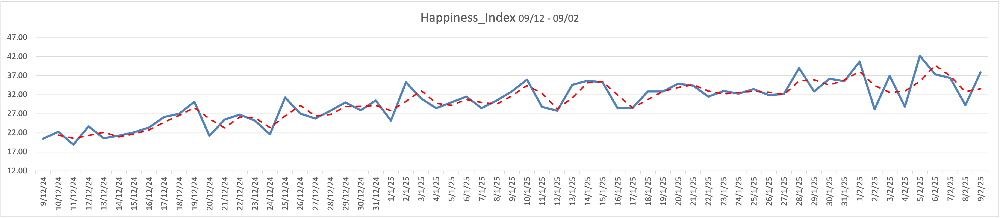
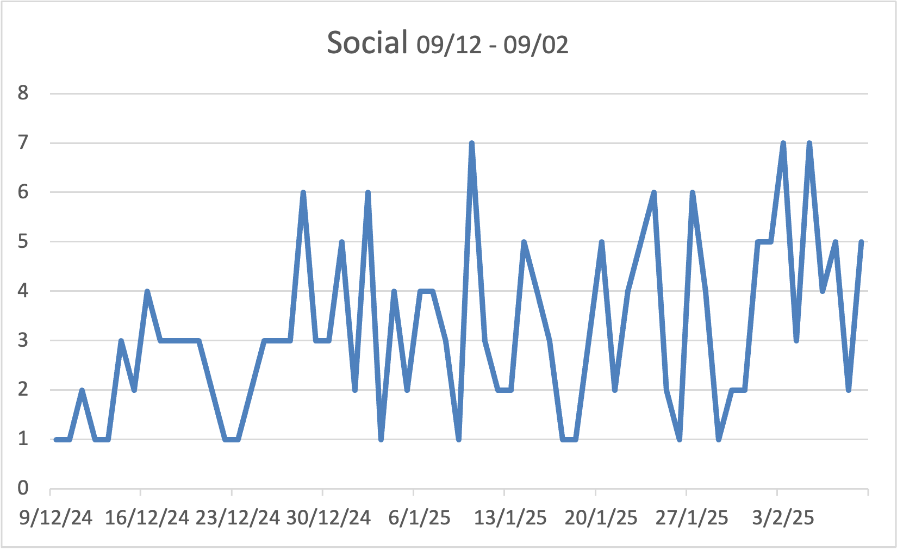

# 📊 Happiness Index Project

**A self-tracked personal data project exploring the link between mood, spirituality, productivity, health, and daily happiness over 2 months.**

---

## 🧠 Background

Between 09/12/24 and 09/02/25, I tracked key personal metrics daily to understand how different aspects of my life impact my emotional and mental well-being. This wasn’t just about numbers — it was about clarity, healing, and uncovering what actually works for me.

---

## 📁 Dataset Dimensions

| Category       | What I Measured                            |
|----------------|---------------------------------------------|
| Happiness      | Daily subjective rating of overall mood     |
| Spirituality   | Salah consistency, connection to Allah      |
| Emotional      | Mood swings, anxiety, calmness              |
| Mental         | Focus, clarity, stress                      |
| Physical       | Energy, sleep, gym, nutrition               |
| Social         | Interaction quantity & quality              |
| Productivity   | Output, consistency, sense of control       |

---

## 📊 Key Visualizations

### 📈 Overall Happiness Trend (Dec–Feb)

> Consistent tracking revealed deep dips in late December, followed by a slow recovery. Not linear — but upward overall.

---

### 🧠 Emotional Stability

> Still volatile in January. Even with external progress, emotional heaviness lingered longer than expected.

---

### 🧠 Mental State

> Cognitive function followed a more stable trajectory than emotions, but still dipped when social isolation increased.

---

### 🕋 Spiritual Routine

> The most consistent upward trend. Shows how spiritual routine acted as a stabilising factor across chaos.

---

### 💪 Physical Energy

> Gym, rest, and clean eating translated into more stable energy days — physical drops often aligned with emotional crashes.

---

### 🧍 Social Interaction

> Social activity didn’t always predict happiness — but *quality* interactions made a noticeable difference.

---

### ✅ Productivity Patterns

> Slow but meaningful increase over time. Days with strong spiritual + physical effort also aligned with higher productivity.

---

## 💡 Reflections

- Healing isn’t just “time passing” — it’s what I *do* during that time.
- Spirituality was the strongest protective factor. Even when emotional and mental state dropped, salah kept the floor steady.
- Emotional improvement was the **last** to come, even after everything else rose. Shows how grief or trauma lags behind effort.
- There’s no single “fix” — but patterns of gym, salah, clean eating, and journaling created a foundation that helped me slowly rebuild.

---

## 🛠️ Tools Used

- **Excel** — Daily entry + graphing
- **GitHub** — Version control + public portfolio
- *(Planned: R or Python for deeper statistical analysis)*

---

## 🚀 What’s Next?

- Use RStudio to calculate correlation matrix between variables
- Try forecasting (ARIMA) for predicting future low/high happiness windows
- Create an interactive Power BI dashboard version for practice

---

## 🙏 Final Note

This project is real. No templates, no tutorials. Just lived experience, tracked with discipline, and broken down to find insight. Whether you're a hiring manager or someone struggling with your own routine, I hope this proves that data doesn't need to be big to be meaningful.

